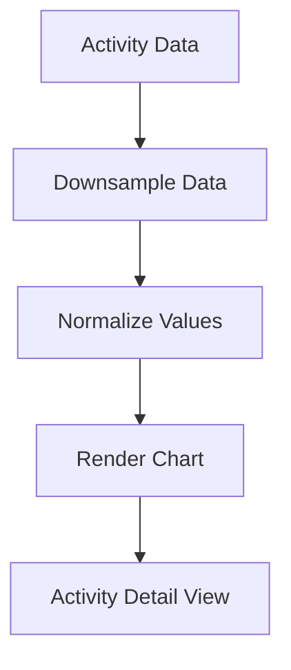

# ASCII Chart Visualization - Design Details

## Objective
Implement terminal-based charts for activity metrics (HR, power, elevation) using Unicode block characters. Charts should be responsive to terminal size and efficiently render large datasets.

## High-Level Design

## Key Components
1. **Data Processing**:
   - Downsampling for large datasets
   - Normalization to terminal height
   - Handling missing data points

2. **Rendering Engine**:
   - Unicode block characters (▁▂▃▄▅▆▇█)
   - Lipgloss for styling
   - Responsive to terminal resize

3. **Integration**:
   - Activity detail screen
   - Performance metrics display

## Relevant Files
- [`internal/tui/components/chart.go`](fitness-tui/internal/tui/components/chart.go) - Chart rendering logic
- [`internal/types/downsample.go`](fitness-tui/internal/types/downsample.go) - Data downsampling
- [`internal/tui/screens/activity_detail.go`](fitness-tui/internal/tui/screens/activity_detail.go) - Integration point

## Exit Criteria
1. Charts render correctly for HR, power, and elevation data
2. Handles terminal resize events
3. Supports datasets up to 10,000 points
4. Unit tests covering 90% of chart logic
5. Integrated into activity detail view